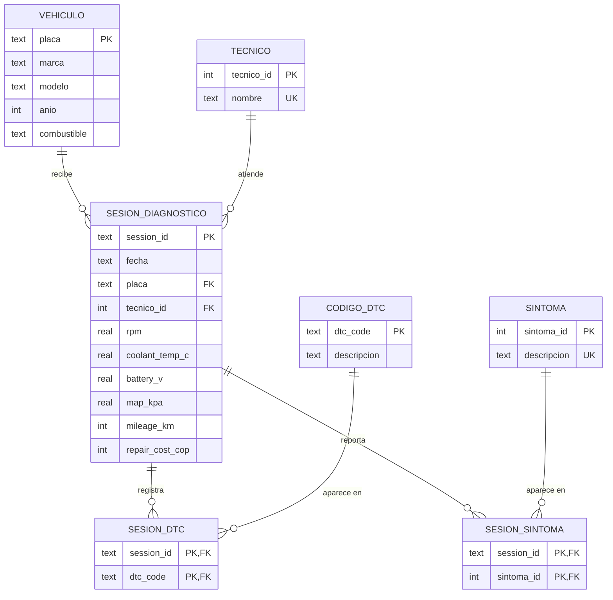

# ERD en Mermaid (se renderiza directamente en GitHub)

```mermaid
erDiagram
    VEHICULO ||--o{ SESION_DIAGNOSTICO : "recibe"
    TECNICO ||--o{ SESION_DIAGNOSTICO : "atiende"
    SESION_DIAGNOSTICO ||--o{ SESION_DTC : "registra"
    CODIGO_DTC ||--o{ SESION_DTC : "aparece en"
    SESION_DIAGNOSTICO ||--o{ SESION_SINTOMA : "reporta"
    SINTOMA ||--o{ SESION_SINTOMA : "aparece en"

    VEHICULO {
        text placa PK
        text marca
        text modelo
        int anio
        text combustible
    }
    TECNICO {
        int tecnico_id PK
        text nombre UK
    }
    CODIGO_DTC {
        text dtc_code PK
        text descripcion
    }
    SINTOMA {
        int sintoma_id PK
        text descripcion UK
    }
    SESION_DIAGNOSTICO {
        text session_id PK
        text fecha
        text placa FK
        int tecnico_id FK
        real rpm
        real coolant_temp_c
        real battery_v
        real map_kpa
        int mileage_km
        int repair_cost_cop
    }
    SESION_DTC {
        text session_id PK, FK
        text dtc_code PK, FK
    }
    SESION_SINTOMA {
        text session_id PK, FK
        int sintoma_id PK, FK
    }
```

Imagen equivalente: [`erd.png`](erd.png) (generada con `dibujar_erd.py`).
