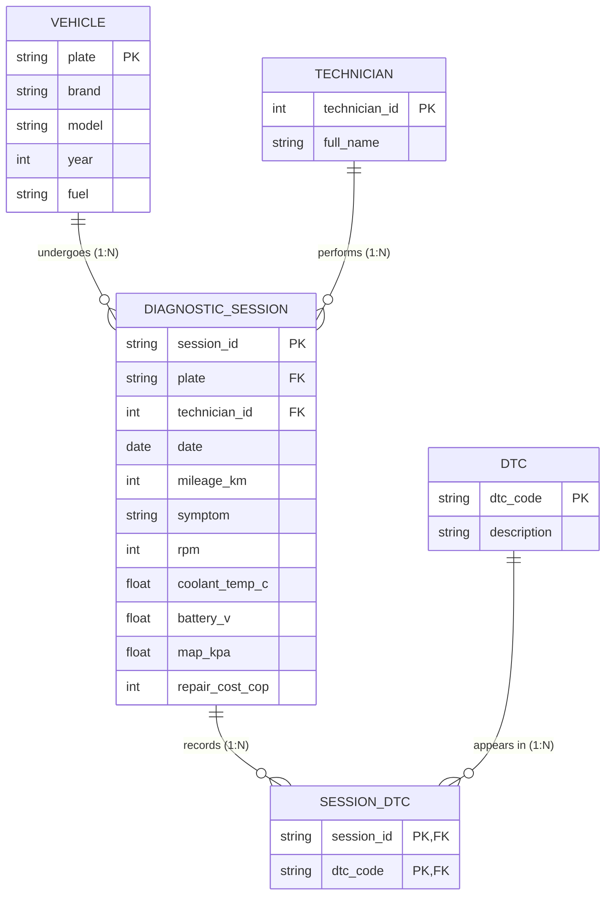

# ERD – Electronic vehicle fault diagnosis

## Cardinalities
Notation and cardinality types (1:1, 1:N, N:M with a junction table) follow CORHUILA (2026a); full reference in the README.

| Relationship | Cardinality | Meaning |
|---|---|---|
| VEHICLE – DIAGNOSTIC_SESSION | 1:N | A vehicle can have many sessions; each session belongs to one vehicle. |
| TECHNICIAN – DIAGNOSTIC_SESSION | 1:N | A technician performs many sessions; each session has one technician. |
| DIAGNOSTIC_SESSION – DTC | N:M (via SESSION_DTC) | A session can store several DTCs and a DTC appears in many sessions. |

In the CSV each session carries a single primary DTC, so SESSION_DTC currently holds one row per session; the model already supports several.
